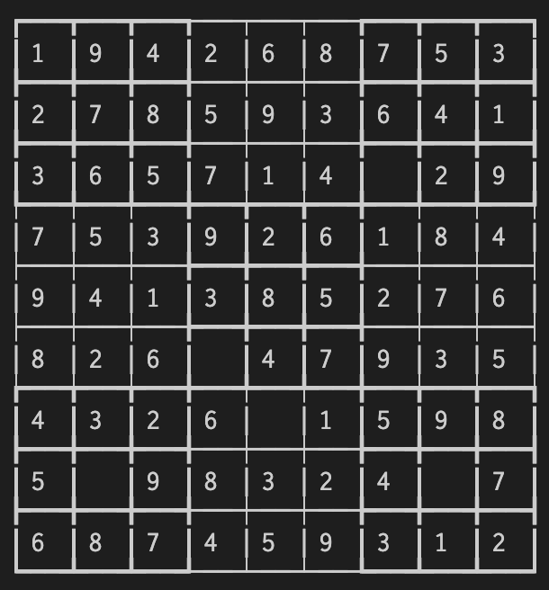

# Sudoku Wizard
## Table of Contents <a id="top"></a>
* [Installation](#installation)
* [Generating Games](#generating-game)
* [Status Messages](#status-messages)
* [Known Issues](#known-issues)

### About
Sudoku wizard implements a backtracking algorithm to generate a completely filled 9x9 Sudoku board where each number 1-9 exists once per column, once per row, and once per 3x3 sub-region according to the normal rules of the game.

After generating a `solved_board`, The algorithm proceeds to randomly remove values from the board, storing the removed value and its coordinates in `removed-values`. To ensure that the removal of the value does not lead to a `starting_board` with multiple solutions, after each value removal the backtracking algorithm is implemented again and solves the game by starting at each currently empty space. If each of these solutions returns the same result (a single unique solution) then the value removal process will proceed to attempt removal of another number until the desired number of "holes" is reached. If the removal of a value leads to multiple possible solutions, the value is replaced and a new random location is selected.

### Installation <a id="installation"></a>

* Installation
 * `gem install 'sudoku_wizard' ` and `require 'sudoku_wizard'` in the Ruby file.
 Or 
 * add `gem 'sudoku_wizard'` to the Gemfile and run `bundle install`

### Usage

#### Generating a new game <a id="generating-game"></a>
 * `Sudoku.new` will instatiate a Sudoku board with 40 empty spaces - referred to as holes.
  * `Sudoku.new` takes two optional arguments: 
    * an integer number of holes
    * a boolean value to enable status messages (`false` by default)
  * The created instance will have the following properties:
    * `difficulty` - represents the number of holes the starting board begins with.
    ```rb
    new_game = Sudoku.new
    new_game.difficulty #=> 40
    ```
    * `removed_values` - an Array of Hashes of length equal to the games `difficulty`. Each index of the array contains the row index (`row_i`) and column index (`col_i`) of a value that was removed from the solved board, along with the value (`val`) that was removed.
    ```rb
    new_game = Sudoku.new(5)
    new_game.removed_values
    #=> [{:row_i=>7, :col_i=>1, :val=>1}, {:row_i=>5, :col_i=>3, :val=>1}, {:row_i=>7, :col_i=>7, :val=>6}, {:row_i=>6, :col_i=>4, :val=>7}, {:row_i=>2, :col_i=>6, :val=>8}]
    ```
    * `solution` - a 9x9 Array of Arrays representing the completed grid of the Sudoku instance.
    ```rb
    new_game = Sudoku.new(5)
    new_game.solution
    #=>   [[1, 9, 4, 2, 6, 8, 7, 5, 3],
    #=>    [2, 7, 8, 5, 9, 3, 6, 4, 1],
    #=>    [3, 6, 5, 7, 1, 4, 8, 2, 9],
    #=>    [7, 5, 3, 9, 2, 6, 1, 8, 4],
    #=>    [9, 4, 1, 3, 8, 5, 2, 7, 6],
    #=>    [8, 2, 6, 1, 4, 7, 9, 3, 5],
    #=>    [4, 3, 2, 6, 7, 1, 5, 9, 8],
    #=>    [5, 1, 9, 8, 3, 2, 4, 6, 7],
    #=>    [6, 8, 7, 4, 5, 9, 3, 1, 2]]
    ```    
    * `starting_board` - a 9s9 Array of Arrays representing the starting board that results from removing each of the `removed_values` from the `solution`
* Rendering the Board:
    ```rb
    new_game = Sudoku.new(5)
    new_game.solution
    #=> [[1, 9, 4, 2, 6, 8, 7, 5, 3],
    #=>  [2, 7, 8, 5, 9, 3, 6, 4, 1],
    #=>  [3, 6, 5, 7, 1, 4, 0, 2, 9],
    #=>  [7, 5, 3, 9, 2, 6, 1, 8, 4],
    #=>  [9, 4, 1, 3, 8, 5, 2, 7, 6],
    #=>  [8, 2, 6, 0, 4, 7, 9, 3, 5],
    #=>  [4, 3, 2, 6, 0, 1, 5, 9, 8],
    #=>  [5, 0, 9, 8, 3, 2, 4, 0, 7],
    #=>  [6, 8, 7, 4, 5, 9, 3, 1, 2]],
    ```   
  * The `solution` and `starting_board` can be rendered to the terminal using ASCII using the `#render` method. `#render` takes in an argument of a string that corresponds to one of its board names (Ex: `"solution"` or `"starting_board"`) and displays it as a grid.
    ```rb
    new_game = Sudoku.new(5)
    new_game.solution
    #=>
    ```   
    

[Top](#top)

#### Status Messages <a id="status-messages"></a>

In working to optimize the algorithm and wait time for game generating, status messages have been built into the codebase to signal:
 * the start of game generation
 * A restart of the generating procees due to creating an impossible game or reaching an iteration count limit. This limit was in place to help monitor the algorithms progress and will hopefully be removed in subsequent updates when the algorithm is more optimized.
 * The conclusion of the game generation will print messages displaying iterations of the previous round needed to generate the board, as well as a poke iteration counter which tracks the number of attempts to remove a value from the board, the time it took to render.
This status messages are disabled by default but may be enabled with a second argument of `true` in the instance creation. If you are havign trouble getting a game to generate, the messages can provide insight.
 * Example:
  * Start/End Success messages for an "easy" game
  ```rb
  new_game = Sudoku.new(35, true)
  #=> Generating Game...
  #=> Board Generated in
  #=> 1_722 Iterations
  #=> 0.234842 seconds
  ```
  * Status messages with error tracking. 
    * Prints error with the count, current board state, and the number of successfully removed values prior to error
  ```rb
  new_game = Sudoku.new(53, true)
  #=> Generating Game...
  #=>too many pokes: 10000001, [[7,2,8,6,4,3,9,1,5],[5,6,9,7,8,1,4,2,3],[4,3,1,2,9,5,8,6,7],[3,7,2,1,5,9,6,0,0],[1,4,0,8,0,0,0,0,9],[8,0,6,0,2,0,0,4,0],[2,0,0,0,0,4,0,9,6],[9,0,4,5,3,0,0,7,0],[0,5,0,0,1,0,0,0,2]] removed: 52
  #=> 921 iterations, Restarting
  
  #=> Board Generated in
  #=> 729 Iterations
  #=> 11.119642 seconds
  ```

[Top](#top)


## Contributing
Pull requests are welcome. Please make sure that your PR is <a href="https://www.netlify.com/blog/2020/03/31/how-to-scope-down-prs/">well-scoped</a>. For major changes, please open an issue first to discuss what you would like to change.

### Known Issues <a id="known-issues"></a>

* Poke Holes and Multiple solutions check methods are functional but not optimized. Generating a game greater than 53 holes is unreliable and can take a very long time. A more efficient method of removing values and confirming them needs to be determined.

[Top](#top)

### Contributors
<table>
  <tr>
    <td align="center"><a href="https://github.com/dsasse07"><br /><sub><b>Daniel Sasse</b></sub></a><br />
  </tr>
</table>
## https://github.com/dsasse07/sudoku-wizard